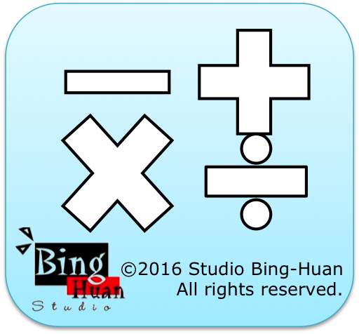

calculator
============

My Blog: <a href="http://studiobinghuan.blogspot.tw/2013/05/calculator.html?view=flipcard">http://studiobinghuan.blogspot.tw/2013/05/calculator.html?view=flipcard</a> 

Link to launch the web app : <a href="http://binghuan.github.io/calculator/">http://binghuan.github.io/calculator/</a> 

This is my second web application .
User can use this simple calculator app,
The feature of this web application is "off-line using".

User can also use this without data connection or network connection.

這是我的第二個網頁應用程式，
本程的的特性是， 使用者可以在離線的環境下， 依然可以使用本網頁應用程式。

